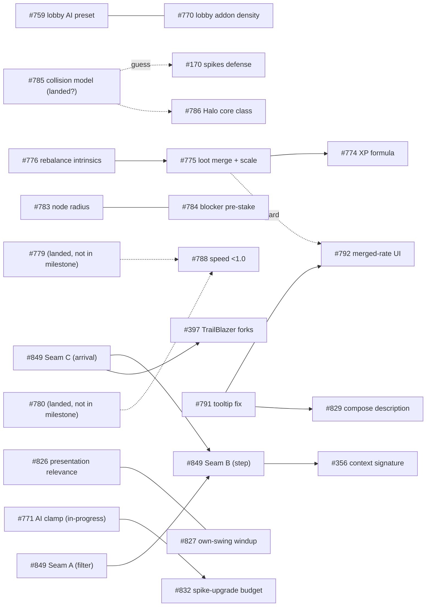

# Post-LAN 2026-09-06 — swarmify clustering DAG

Indexed 2026-09-12. Milestone #20, 34 open issues (task brief said ~29 — actual
count from `gh issue list --milestone "Post-LAN 2026-09-06" --state open` is 34).
Lanes below are from `mise gh-project -- list <lane>` cross-referenced by number,
not from labels (labels and lane can disagree — e.g. #816 has no `design` label
but sits in `needs-design`).

FOCUS.md carries no per-issue state (by design, see `docs/domain/issue-workflow.md`),
but it does name **#537 "AI combat reads"** as lane 4 of the (now-past) LAN
milestone — that issue is still open, still `needs-design`, and carried straight
into this milestone. Treat it as a priority carryover, not a guess.

## Issue table

| # | Title | Lane | Subsystem(s) | What it really is |
|---|---|---|---|---|
| 170 | Spikes as defensive counter (pop incoming blades) | in-progress | `attack/melee` (BladeHitScan), `skill_node/addons/spike_ring_addon.gd` | Milestone-sized design: collision model + mechanic for defensive spikes |
| 257 | InnerDisk shatter should use real texture fragmentation | in-review | node-death VFX, sandbox_host | VFX polish + a force-dealloc-cascade-order verification ask, near done |
| 356 | Unify PropagationContext signature (filter/step/reducer/crit) | needs-design | `attack/spell/` propagation pipeline | Refactor; **child of hub #849**, sequenced after Seam B |
| 397 | TrailBlazer walk forks (unbounded trail, degree-1 tip, slam AoE) | backlog | `attack/spell/trail_blazer_step.gd` | 3 design forks; **child of hub #849**, sequenced after Seam C |
| 409 | Edge sharpeners | needs-design | `graph/edge` | Blocked on #407 (not in milestone) — dead in the water until then |
| 537 | AI two-tier candidate gating (ranged/magic) | needs-design | `systems/ai_controller.gd` | Perf-shaped AI fork, owner-prescribed shape already (mirrors AiBladeRollout) — **FOCUS carryover** |
| 759 | Lobby: AI slots get plain core + preset-row templating | needs-design | `ui/frontmatter/panels/lobby_panel.gd`/`lobby_screen.gd` | LAN finding: lobby UX for AI setup |
| 766 | Mana/mana regen never bind — remove or rework | needs-design | `stats_system/defs` (mana) | Balance fork: remove vs rework scaling |
| 767 | No way to gain tempo — AP cannot be regained/raised | needs-design | `stats_system/defs` (AP), `systems/turn_manager.gd` | Balance fork, explicit flip-side of #766 |
| 768 | Turn-order bar reads full at every tie | needs-design | `ui/hud` (turn order widget, inside `hud_root.gd`'s roster) | UI/UX fork: display initiative+queue, not initiative alone |
| 770 | Lobby: procgen addon density controllable/off | needs-design | `ui/frontmatter/panels/lobby_panel.gd`, `procgen/pools/addon_policy.gd` | LAN finding: expose existing `AddonPolicy.slot_*` knob in lobby |
| 771 | AI: build the weapon — clamp first blade joints unless triangulated | in-progress | `attack/plan/`, `ai_blade_rollout.gd`, `skill_node/addons/clamp_addon.gd` | AI competence fix, currently being worked |
| 774 | Kill XP over-tuned — additive payout, xp_reward as board stat | needs-design | `systems/loot_system.gd`, `stats_system/defs/xp.tres` | Balance/formula fix |
| 775 | Loot: scale looted modifier coeff by blocker size + MERGE grants | needs-design | `systems/loot_system.gd`, blocker board `.tres` | Balance + new merge mechanism |
| 776 | Rebalance "+1 X per Y Z" intrinsics (thin default, stacking = spec) | needs-design | `entity/default_entity_board.tres`, blocker boards | Balance retune, same board files as #775 |
| 783 | Procgen: node radius scales with modifier budget | needs-design | `procgen/graph_procgen.gd`, `procgen/modules/topology.gd` | Legibility/visual + map-size-estimate math |
| 784 | Blockers: chance to pre-Stake their squatted node | needs-design | `procgen/graph_procgen.gd` (archetype/budget loop) | Balance/territory reward, mechanism mostly exists |
| 786 | Implement the Halo core class | needs-design | `entity/core/`, `skill_node/addons` (spike ring) | New core class, needs remaining design after #772/#785 |
| 788 | Speed multiplier below 1.0 + compensating base-damage rebalance | needs-design | `attack/melee` (speed-scaled damage), AI scorer | Balance fork, blocked on playing #779/#780 first |
| 791 | AttributeRules tooltip: fix "->", raw float, wrong number | needs-design | `ui/hud/attribute_rules.gd`, `stats_system/stat_modifier.gd` | UI bug-fix, 3 defects in one line |
| 792 | Merged innate modifier must render as one rule, everywhere | needs-design | same `stat_modifier.gd`/`attribute_rules.gd` + `combat_card_melee.gd` | UI correctness, **hard-depends on #775's merge landing** |
| 793 | CombatReadout cards missing stat rows + stat→surface map | needs-design | `ui/hud/combat_readout/*` | UI gap-fill, partly blocked on already-landed #778 |
| 816 | Melee solver: one backend or two? (C++ vs parity contract) | in-progress | `attack/melee/sim/blade_sim.gd`, `native/src/blade_solver_native.cpp` | Big DX/architecture call, owner-named |
| 826 | Presentation rate should follow relevance (vision+ownership), not seat | needs-design | `OutcomeSchedule`, `CommandApplier._pre_roll`, `CameraDirector` | Presentation-clock design, successor to retired #819 |
| 827 | Own melee swing gets a commit-time wind-up too (reverses #559 D2) | needs-design | `attack/melee/melee_preview.gd` | Presentation-clock design, owner reversal |
| 828 | Sweeping your own CORE as blade member should mean something | needs-design | `attack/plan/`, entity core | New mechanic fork (bonus/penalty shape undecided) |
| 829 | StatDef.description should compose ratio clause from formula | backlog | `stats_system/stat_def.gd`, `defs/blade_size.tres`, `defs/strength.tres` | Tech-debt: kill a whole class of stale-description drift |
| 830 | rules-hygiene: stats-system.md is 803 lines, 2.6x scoped budget | backlog | `.claude/rules/stats-system.md` | Pure docs split, no code touch |
| 831 | Melee resolve cost: hit-scan dominates, not substeps | backlog | `attack/melee/sim`, `test/perf/bench_blade_hit_scan.gd` | Perf investigation, candidate levers only, not yet actioned |
| 832 | AI SPIKE_UPGRADE needs budget API to see phantom spend first | backlog | `attack/plan/melee_attack_plan.gd`, `ai_blade_rollout.gd` | AI feature blocked on an accounting fix; split from #824/#771 |
| 833 | bench_melee_prediction_cost hardcodes stale 6x16x2=192 | backlog | `test/perf/bench_melee_prediction_cost.gd` | Bench-honesty tech debt, cheap fix |
| 834 | bench_ai_turn's 4-node fixture can't see #824's cap lift | backlog | `test/perf/bench_ai_turn.gd` | Bench-honesty tech debt, needs a bigger fixture |
| 836 | Evaluate worktrunk (wt) to replace hand-rolled worktree tasks | backlog | `mise` tooling, no game code | Infra spike, fully decoupled from game code |
| 849 | Hub: spell pipeline — one role per stage | backlog | `attack/spell/` propagation pipeline | Hub; owner has already pinned Seams A/B/C shape |

## Clusters

### Cluster 1 — Spell propagation pipeline hub (#849, #356, #397)

> **CORRECTED 2026-09-12 — all three seams have already SHIPPED.** The first
> index of this doc read #849's body and planned the seams as future work. They
> are not: **#850 (Seam A) and #851 (Seam C) closed 2026-09-10, #852 (Seam B)
> closed 2026-09-11**, all three on master. `PropagationStep` is gone;
> `PropagationSpread.select` + `PropagationConfig.mint` + `LandingCondition` +
> `ScaleDamageEffect` are the shipped shape. **First action on this cluster is
> to CLOSE the hub #849**, not to swarmify it.

**Why they cluster:** owner-stated parent/child. #849 named three seams and
re-parented #356 after Seam B and #397 after Seam C. Both gates are now open.
**What actually remains:** #356 and #397 only — and they are **independent of
each other**, so they are a genuine parallel pair.
- **#356** (unify the `PropagationContext` signature across filter / spread /
  reducer / crit) — mechanical, now that `select`/`mint`/`narrow` have settled
  into their final signatures. Touches every stage file, so it collides with
  anything else in `attack/spell/propagation/`.
- **#397** (TrailBlazer walk forks) — pure design, needs owner forks settled;
  touches `trail_blazer_spread.gd` + `trail_blazer.tres`.
**Order:** close #849 → dispatch #356 and #397 in parallel (no shared file
*if* #397 stays inside `spread/` and #356 stays out of it; otherwise serialize).
**Stale-path warning:** #356 and #397 bodies name `propagation_step.gd`,
`trail_blazer_step.gd`, `crit_condition.gd` and `DegreeFilter` — **every one of
those files is gone**. Re-point both issues onto current master during the
swarmify pass before briefing any drone off them.

### Cluster 2 — Loot & intrinsic-modifier balance (#774, #775, #776)
**Why they cluster:** all three are 2026-09-07 owner post-LAN quotes about the
same runaway-power problem, and all three edit `systems/loot_system.gd` and/or
the board `.tres` files (`entity/default_entity_board.tres`, the three blocker
boards). #775 depends conceptually on #776's retuned rates (merging into a
"thin default" only matters once the default is thin) and #774 is XP-specific
but shares the same file (`loot_system.gd`).
**Order (soft):** #776 (retune base rates) → #775 (per-size scaled loot + merge
mechanism, built on the new rates) → #774 (fix the XP formula itself, can run
in parallel with the other two but same file — sequence, don't parallelize).
**Collision:** #774 and #775 both edit `loot_system.gd`; #775 and #776 both edit
the blocker board `.tres` set. Do not dispatch any two of these to parallel
drones without a merge plan.

### Cluster 3 — Modifier display/composition machinery (#791, #792, #829)
**Why they cluster:** all three touch `StatModifier`/`StatDef` formatting code.
#791 fixes the tooltip's per-rule number (`ui/hud/attribute_rules.gd`,
`format_effective`); #792 is a **hard** dependency on #775 (merge lands) and
touches the *same* file/method as #791 plus `combat_card_melee.gd`; #829 removes
hand-written ratio clauses from `StatDef.description` in favor of composing from
the formula — same composition machinery (`describe_per()`/`describe_clause()`)
that #792 leans on.
**Order:** #791 first (fixes the shared rendering path cleanly) → #792 (depends
on #775 landing; reuses #791's fixed formatting) → #829 can run anytime,
independent of the merge, but touches adjacent code — sequence after #791 to
avoid a formatting-helper collision.
**Collision:** #791 and #792 both edit `ui/hud/attribute_rules.gd` — do not
parallelize.

### Cluster 4 — Lobby UI (#759, #770)
**Why they cluster:** both are LAN findings that add controls to the same
lobby screen (`ui/frontmatter/panels/lobby_panel.gd` / `lobby_screen.gd`) — #759
adds AI-slot core assignment + a preset row, #770 adds an addon-density
knob/toggle. Same file surface, no shared logic otherwise.
**Order:** independent designs, no hard dependency — but same file, so land
serially or assign to one drone.
**Collision:** both touch `lobby_panel.gd`. Flag for serial dispatch.

### Cluster 5 — Mana/AP economy (#766, #767)
**Why they cluster:** explicitly cross-referenced in both bodies as "two sides
of the same coin" (#766: mana never binds because AP is the real gate; #767: if
AP is the real constraint, that's where decisions should live). No file overlap
expected (mana stat removal/rework vs. AP regen mechanism) but the *design*
answer to one changes the shape of the other — settle together with the user in
one swarmify session even if implemented as separate children.
**Order:** discuss #766 first (remove vs. rework mana) since its answer decides
whether AP design has to also subsume mana's role.

### Cluster 6 — AI blade-building competence (#771, #788, #832)
**Why they cluster:** #771 (in-progress) is the base "AI builds a weapon"
competence fix; #788 explicitly says it "expands #771"; #832 is a budget-
accounting prerequisite split out of #771/#824's own notes. All three touch
`attack/plan/melee_attack_plan.gd` and/or `ai_blade_rollout.gd`.
**Order:** #771 lands first (in-progress, don't disturb) → #832 (fixes the
budget API gap that #771's own follow-on work needs) → #788 (needs #779/#780
*played* first per the issue itself, so this is the last of the three
regardless).
**Collision:** #832 must not be dispatched while #771 is still in-progress and
touching the same files — check #771's branch state before starting #832.

### Cluster 7 — Procgen node sizing/territory (#783, #784)
**Why they cluster:** both edit `procgen/graph_procgen.gd`, in the same
archetype/budget loop (#783 at the node-radius stamp ~line 277, #784 at the
archetype/budget branch ~line 283-296) — adjacent lines, real merge-conflict
risk.
**Order:** no hard dependency; #783 is pure visual/legibility, #784 is a balance
mechanic. Land one before starting the other to avoid the adjacent-line clobber.

### Cluster 8 — Melee presentation-clock design (#826, #827)
**Why they cluster:** both are timing/pacing decisions in the same lineage
(#559 → #819 → #826/#827), both owner calls from the 2026-09-10 session. Files
differ (#826: `OutcomeSchedule`/`CommandApplier`/`CameraDirector`; #827:
`melee_preview.gd`) but both must respect `.claude/rules/presentation-clock.md`
and interact conceptually (relevance-based rate vs. seated wind-up both change
how long a swing takes to read).
**Order:** independent — no file collision — but review together since a
reviewer checking one should sanity-check the other doesn't regress it.

### Cluster 9 — Spikes/core-mechanic design cloud (#170, #786, #828)
**Why they cluster (guess):** #170's open "collision model" question is the
same one #786 says was **already settled** by #772/#785 ("gated behind the
collision-model decision — which #772/#785 has now made"). If true, #170 may be
substantially unblocked and should be re-examined alongside #786 (both are
spike-ring/shell mechanics) and #828 (core-as-blade-member bonus, same
`attack/plan` composition surface Halo's shell-swing touches). **(guess — verify
#785's decision text actually covers #170's blade-vs-blade case before treating
#170 as unblocked.)**
**Order:** confirm the #785 collision-model applies to #170 first; then #786 and
#828 can proceed as mostly-independent design forks.

### Cluster 10 — Bench/tech-debt hygiene (#831, #833, #834, #830, #836)
**Why they cluster:** all low-risk, well-scoped tech-debt items with concrete
options already laid out in-body (little/no design negotiation needed). Files
are all disjoint (`bench_blade_hit_scan.gd`/`bench_authoritative_resolve_cost.gd`
for #831, `bench_melee_prediction_cost.gd` for #833, `bench_ai_turn.gd` for
#834, a rule-doc split for #830, pure tooling for #836) — **no collisions**,
fully parallelizable once promoted to Ready.
**Order:** none required; good filler work / good candidates for a fast
swarmify pass with minimal owner time, since each already states its own
options ("either is fine, prefer whichever...").
**Note:** #830 (rule-doc split) is cheaper to do *after* Cluster 2/3 land, since
the stat-system rule will need updating again once loot-merge and description
composition change the mechanics it describes — otherwise it's a doc split that
goes stale within the same milestone.

### Standalone / low-interaction
- **#537** — FOCUS-carryover priority, self-contained AI perf fork, shape
  already prescribed by the owner on #498. Good swarmify candidate on its own.
- **#768** — turn-order bar UI, no file overlap with lobby cluster; the "honest
  display" fork (initiative + tie-break queue) needs a UI mockup/design pass.
- **#793** — CombatReadout gaps; `node_health` row is unblocked now, the
  `spike_regen`/`blunting` rows were gated on #778 which reads as already landed
  (referenced past-tense elsewhere) — worth a quick check before assuming still
  blocked.
- **#409** — hard-blocked on #407 (not in this milestone). Do not swarmify until
  #407 lands; if #407 isn't scheduled, this issue is dead weight in the queue.
- **#816** — big standalone architecture call (in-progress), no dependents in
  this milestone's issue set; whatever it decides doesn't gate anything else
  here since the melee sim files it touches aren't touched by other open issues.
- **#829** — could also run standalone if Cluster 3 isn't picked up together;
  listed there because of the shared composition-helper risk, not a hard need.

## The DAG

(`-->` hard dependency, `-.->` soft/guessed dependency, `---` file-collision-only
pairing with no design dependency.)

### Hard vs soft, spelled out
- **Hard:** #849 Seam B is undecidable until both A and C land (it rewrites code
  both seams touch). #356 can't be written against the new signature until B
  exists. #397 can't be written against the new arrival-effect shape until C
  exists. #792 cannot be *correctly acceptance-spec'd* until #775's merge exists
  — the UI issue literally says "once #775 makes... merge... every surface must
  show the new rate."
- **Soft (cheaper-after, not blocked):** #776 before #775 (retuned rates make
  the merge meaningful, but #775 could technically be built against today's
  rates); #791 before #792/#829 (shared formatting fix, avoids two drones
  touching the same tooltip line); #830 after Cluster 2/3 (doc would need a
  second pass otherwise).
- **Guessed:** #170 vs #785, and #786 vs #785 — I have not read #785 or #772
  directly (not in this milestone's open set, so presumably closed/landed);
  the claim that they settle #170's collision-model fork is read off #786's
  own body, not verified against #785's text.

## Collision warnings (do not parallelize)

| Pair | File(s) | Why |
|---|---|---|
| #774 / #775 | `systems/loot_system.gd` | Both edit the same file, different regions |
| #775 / #776 | blocker board `.tres` files | Both retune the same modifier set |
| #791 / #792 | `ui/hud/attribute_rules.gd` | Both rewrite the tooltip-line rendering |
| #759 / #770 | `ui/frontmatter/panels/lobby_panel.gd` (+ `lobby_screen.gd`) | Both add lobby controls |
| #783 / #784 | `procgen/graph_procgen.gd` (adjacent lines ~277-296) | Same loop, adjacent stamps |
| #771 / #832 | `attack/plan/melee_attack_plan.gd`, `ai_blade_rollout.gd` | #832 is explicitly a follow-on to #771's in-flight work |

## Suggested first wave

**Zeroth, and it is five minutes: close #849.** All three of its seams shipped
(#850/#851 on 2026-09-10, #852 on 2026-09-11). Leaving the hub open is how the
first pass of this very document came to plan a wave of already-written code —
and it will mislead the next reader the same way. Close it, then re-point #356
and #397 onto current master (their bodies name four deleted files).

**Then #356 + #397 as the first real pair.** They were the hub's blocked
children; both gates are open as of 2026-09-11, and they are independent of
each other. #356 is mechanical (one context signature across the stages, now
that the stage signatures have settled) and #397 is pure design forks — so they
want different treatment: #356 is nearly Ready as-is, #397 needs a real
swarmify conversation about the walk forks.

**#537 close behind, run independently.** It's the FOCUS.md priority carryover
from the LAN milestone, already has an owner-prescribed shape (mirror
`AiBladeRollout`'s two-tier pattern), and touches no files any other open issue
touches — zero collision risk, fast swarmify pass.

**Cluster 2 (loot/balance) third**, given how much direct owner engagement
it already has (verbatim post-LAN quotes) — but dispatch its three issues
*serially*, per the collision warnings above, not as a swarm wave.

Everything else (lobby cluster, mana/AP, melee presentation-clock cluster,
spikes cloud, bench hygiene) can queue behind those three in whatever order
FOCUS.md ends up naming once it's updated for this milestone — none of them
block Cluster 1, #537, or Cluster 2.
